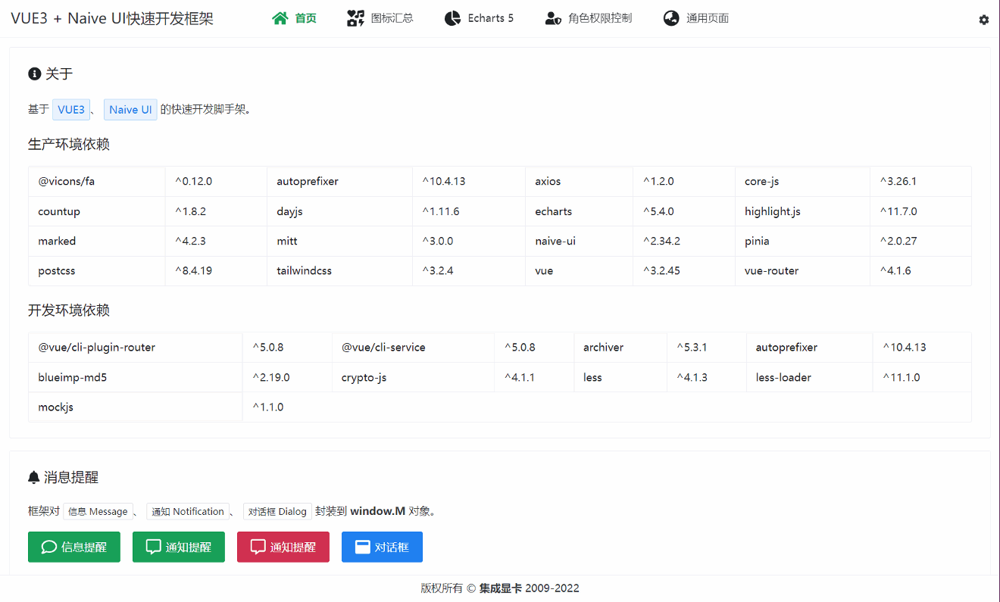
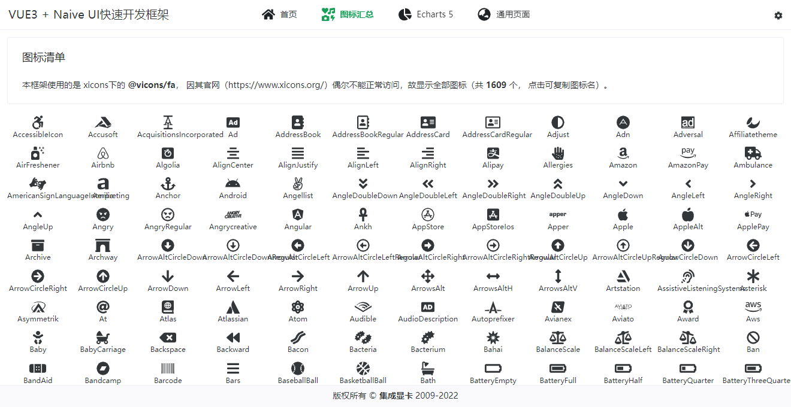
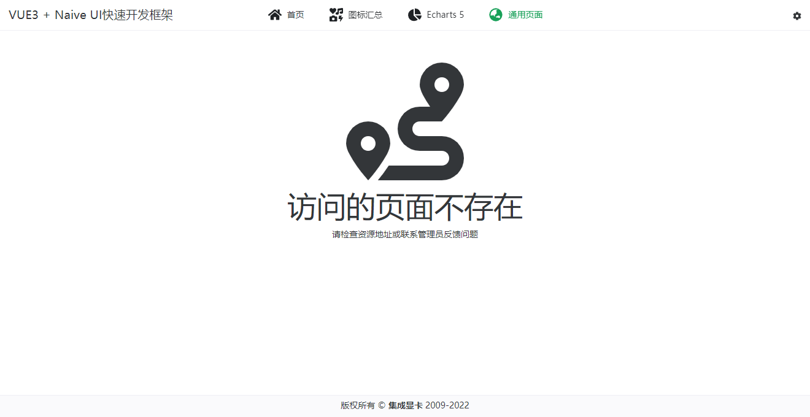
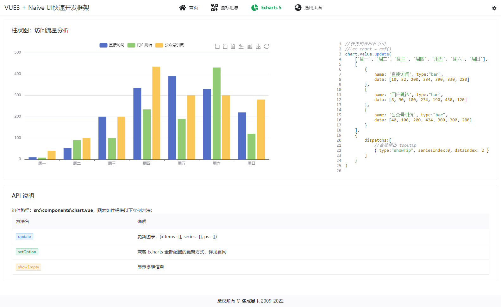

<div align=center>
<h1>🎉 VUE3 NAIVE STARTER 🎉</h1>


</div>

> [VUE3](https://cn.vuejs.org/) + [Naive UI](https://www.naiveui.com) 快速开发框架


<div align=center>

## 功能 / FEATURE 🎉

</div>

- ✅ 基于 Vue3、Naive-UI、Tailwind CSS、Echarts 5
- ✅ 纯 `JavaScript`
- ✅ 集成 `Mock`、多页面等配置
- ⭕ 敬请期待……

<div align=center>

## 使用方法 / HOW-TO-USE 📖

</div>

```shell
# 先安装依赖 `npm i`（建议使用） OR `yarn install`

npm run serve
# 以 MOCK 模式启动（无需后台服务）
npm run serve:mock
# 打包（保存到 dist 目录）
npm run build
```

<div align=center>

## 运行截图 / SCREEN-SHOT 🖼️

</div>

<center>
    
    
</center>
<center>
    
    
</center>

<center>
    
</center>
